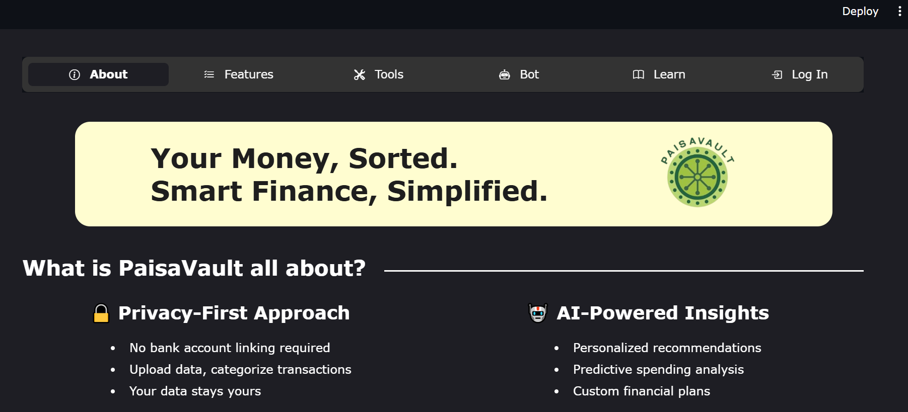
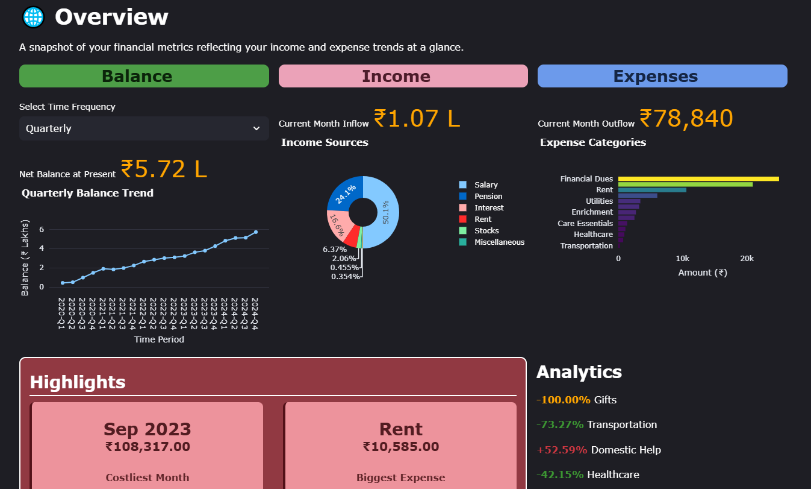
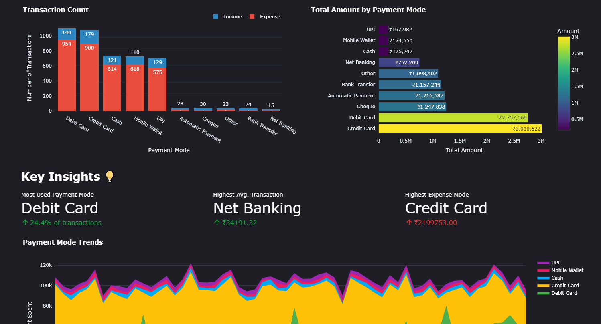
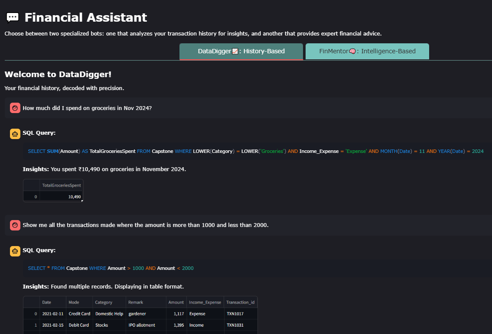
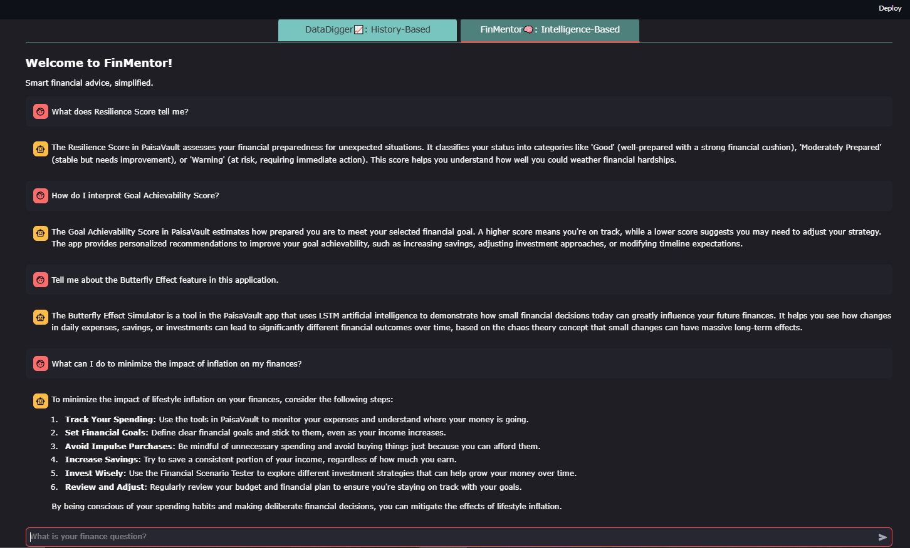
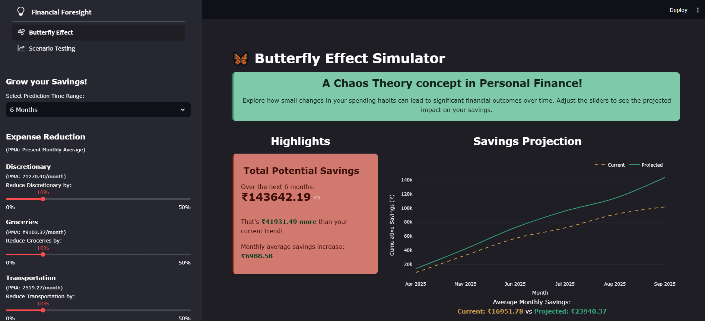
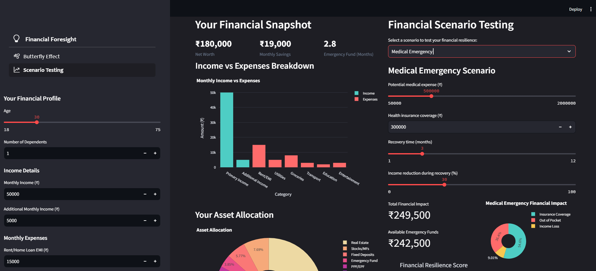

# AI Assisted Personal Finance Management System

<p align="justify">
A lightweight, privacy-focused financial management tool with intelligent features to help you make better financial decisions without requiring external account integration.
</p>

<div align="center">
  
</div>

## Key Features
- **Butterfly Effect Simulator:** LSTM model showing the compounding impact of small financial changes over time, reflecting the butterfly effect concept of chaos theory in personal finance.
- **Financial Scenario Tester:** XGBoost model for stress testing various financial situations (market crash, medical emergency, job loss) and assessing likelihood of reaching financial milestones (education, home purchase, investments).
- **AI-Powered Assistant:** Custom chatbot using Mistral Saba 24B to answer both transactional and financial queries.
- **Privacy-First Design:** No external account integration required, eliminating data security concerns.

## Tech Stack
### Frontend  
[](https://streamlit.io/) [](https://developer.mozilla.org/en-US/docs/Web/HTML) [](https://developer.mozilla.org/en-US/docs/Web/CSS)

### Backend 
[](https://www.python.org/) [](https://huggingface.co/) [](https://www.trychroma.com/) [](https://groq.com/)

### Database  
[](https://www.mysql.com/)

### Libraries  
[](https://www.tensorflow.org/) [](https://numpy.org/) [](https://keras.io/) [](https://pandas.pydata.org/) [](https://plotly.com/) [](https://scikit-learn.org/) [](https://matplotlib.org/) [](https://www.langchain.com/)  

### Evaluation
[](https://pytorch.org/) [](https://www.nltk.org/) [](https://pypi.org/project/rouge-score/) [](https://github.com/mjpost/sacrebleu) [](https://github.com/explodinggradients/ragas) [](https://docs.python.org/3/library/asyncio.html)

## Installation

### Prerequisites
- Windows 10/11
- Minimum 8GB RAM
- MySQL
- Groq API access

### Set up
1. Clone the repository.
   
   `git clone https://github.com/shrutishrinivasan/capstone-project.git`

2. Install dependencies.
   
   `pip install -r requirements.txt`

3. Configure API Access.
   - Open the `.env` file in the root directory.  
   - Add your Groq API key:  
     ```env
     GROQ_API_KEY=your_api_key_here
   - Update MySQL credentials in `chatbot.py`

4. Launch the application.
   
   `python -m streamlit run app.py`

## Usage Guide
### Application Layout
- **Landing Page:** About, Features, Tools, Bot, Learn, Login sections
- **Personal Dashboard:** Getting Started, Upload Data, Overview, Income/Expense, Financial Foresight, Custom Bot, Resources, Logout sections 

### Frontend Screenshots
### Overview Section
<div align="center">
  
  
</div>

### Chatbot Section
<div align="center">
  
  
</div>

### Butterfly Effect Simulator
<div align="center">
  
</div>

### Financial Scenario Tester
<div align="center">
  
</div>

To see more frontend screenshots, please refer the output folder.
